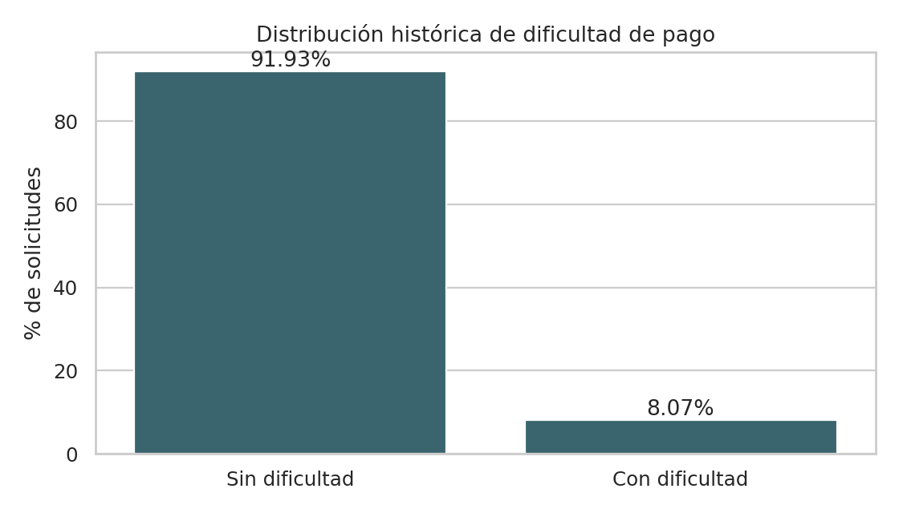
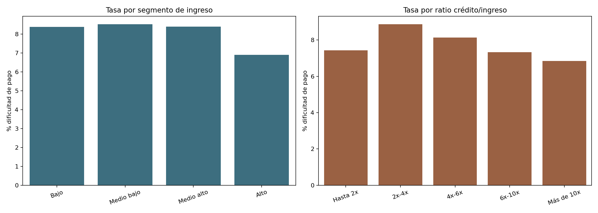
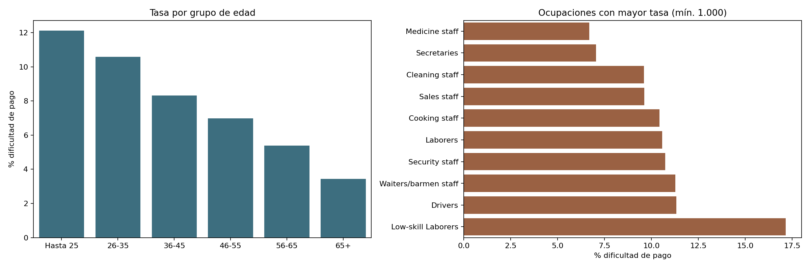
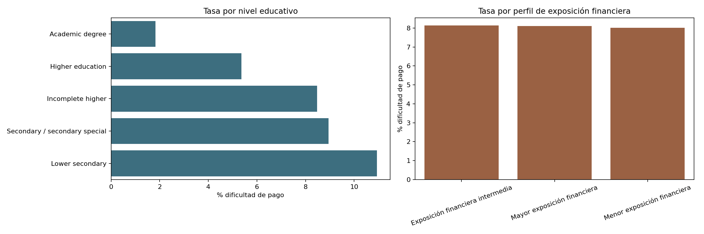
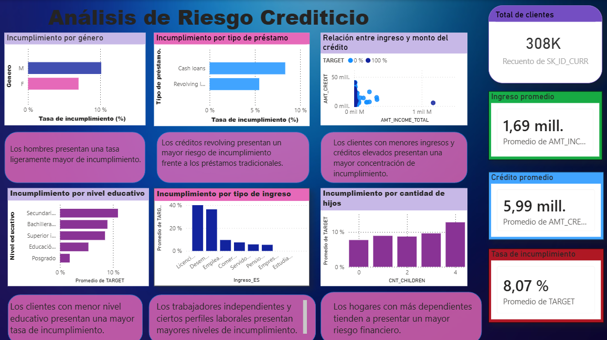

# Credit Risk Analytics: Análisis De Perfiles De Riesgo Crediticio

Proyecto de análisis exploratorio de datos orientado a comprender patrones
históricos de dificultad de pago en solicitudes de crédito utilizando **Home
Credit Default Risk**.

La pregunta que guía el proyecto es:

> ¿Qué características presentan los segmentos con mayor tasa observada de
> dificultad de pago y cómo puede una entidad financiera visualizar estos
> patrones para apoyar el seguimiento de su cartera?

## Alcance

Este es un proyecto de **análisis de datos y business intelligence**:

- Realiza entendimiento de negocio, calidad de datos, limpieza, creación de
  indicadores financieros, EDA y preparación para Power BI.
- Explica cada paso en notebooks narrativos en español, incluyendo tablas sobre
  las funciones utilizadas y una lectura breve línea por línea antes de cada
  bloque de código.
- Incluye comentarios `#` dentro de cada celda Python para acompañar la
  ejecución línea por línea mientras se estudia el notebook.
- Mantiene toda la lógica del análisis dentro de los notebooks para que el
  recorrido pueda leerse, ejecutarse y aprenderse sin módulos auxiliares.
- No entrena modelos, no asigna probabilidades individuales y no propone
  aprobación o rechazo automático de solicitudes.

## Dataset

Se utiliza `application_train.csv` del conjunto
[Home Credit Default Risk de Kaggle](https://www.kaggle.com/competitions/home-credit-default-risk/data).
La variable `TARGET` indica el resultado histórico analizado:

| Valor | Interpretación |
|---:|---|
| `0` | Solicitud sin dificultad de pago reportada |
| `1` | Solicitud con dificultad de pago |

El archivo debe ubicarse localmente en:

```text
data/raw/application_train.csv
```

El CSV fuente y el CSV limpio no se incluyen en Git porque contienen
información a nivel de solicitud y son artefactos pesados.

## Proceso Analítico

| Etapa | Qué hago | Entregable |
|---|---|---|
| Entendimiento del negocio | Defino pregunta, KPIs, límites y uso responsable | `01_business_understanding.ipynb` |
| Entendimiento de datos | Reviso dimensiones, `TARGET`, nulos y anomalías | `02_data_understanding.ipynb` |
| Preparación | Limpio variables y creo indicadores financieros | `03_data_cleaning_feature_engineering.ipynb` |
| EDA y conclusiones | Comparo tasas por segmentos y exporto gráficos/reporte | `04_exploratory_credit_risk_analysis.ipynb` |
| Dashboard ejecutivo | Presento los indicadores y segmentos en Power BI | [`powerbi/archivo de power bi.pbix`](powerbi/archivo%20de%20power%20bi.pbix) |

## Indicadores Creados

| Indicador | Significado |
|---|---|
| `AGE` | Edad aproximada del solicitante en años |
| `YEARS_EMPLOYED` | Antigüedad laboral aproximada; el centinela `365243` se trata como ausente |
| `CREDIT_INCOME_RATIO` | Relación entre monto del crédito e ingreso |
| `ANNUITY_INCOME_RATIO` | Relación entre cuota anual e ingreso |
| `INCOME_SEGMENT` | Segmentos de ingreso construidos por cuartiles |
| `CREDIT_INCOME_SEGMENT` | Rangos del ratio crédito/ingreso |
| `ANALYTICAL_PROFILE` | Perfil de exposición financiera exploratorio, no un score |

## Resultados Principales

### Panorama General

| KPI | Resultado |
|---|---:|
| Total de solicitudes | 307.511 |
| Solicitudes con dificultad de pago | 24.825 |
| Tasa de dificultad de pago | 8,07% |
| Ingreso promedio | 168.797,92 |
| Crédito promedio | 599.026,00 |
| Ratio crédito/ingreso promedio | 3,96x |
| Edad promedio | 43,9 años |

### Hallazgos

- El segmento de ingreso **medio bajo** registra la tasa más alta por ingreso:
  **8,53%**; el segmento alto presenta **6,91%**.
- El ratio crédito/ingreso no muestra una relación creciente simple: el rango
  `2x-4x` presenta la mayor tasa (**8,87%**) y los rangos más altos no la
  superan.
- La tasa disminuye por grupo de edad en este dataset: **12,11%** en hasta 25
  años frente a **3,44%** en 65+.
- Entre ocupaciones con al menos 1.000 solicitudes, `Low-skill Laborers`
  presenta la mayor tasa observada: **17,15%**.
- El perfil financiero basado en reglas produce tasas cercanas entre grupos;
  es útil para describir exposición de la cartera, pero no para clasificar
  dificultad de pago.

El informe reproducible está en
[reports/credit_risk_analysis_report.md](reports/credit_risk_analysis_report.md).

## Visualizaciones

| Distribución general de `TARGET` | Segmentos financieros |
|---|---|
|  |  |

| Edad y ocupación | Educación y exposición financiera |
|---|---|
|  |  |

### Dashboard Ejecutivo En Power BI

El análisis se consolidó en un dashboard ejecutivo que permite leer los KPIs
generales y contrastar la dificultad de pago observada por género, tipo de
préstamo, nivel educativo, tipo de ingreso y cantidad de hijos.



- **Archivo Power BI:** [`powerbi/archivo de power bi.pbix`](powerbi/archivo%20de%20power%20bi.pbix)
- **Documentación del dashboard:** [powerbi/README.md](powerbi/README.md)

## Power BI

El dashboard fue construido manualmente en Power BI Desktop a partir del CSV
limpio generado por los notebooks. La guía completa se encuentra en
[powerbi/README.md](powerbi/README.md) y documenta:

- Fuente que debe cargarse: `data/clean/credit_risk_clean.csv`.
- Medidas DAX para tarjetas y tasas.
- Componentes incluidos en la vista ejecutiva.
- Validaciones de resultados y límites de interpretación.
- Archivo `.pbix` descargable y captura visible desde GitHub.

## Estructura Del Repositorio

```text
credit-risk-analytics/
├── data/
│   ├── raw/                         # Dataset fuente local, ignorado
│   └── clean/                       # CSV para Power BI local, ignorado
├── images/                          # Gráficos del EDA y vista previa del dashboard
├── notebooks/                       # Storytelling y análisis ejecutado
├── powerbi/                         # Archivo .pbix y documentación del dashboard
├── reports/
│   ├── credit_risk_analysis_report.md
│   └── dashboard_screenshots/       # Espacio opcional para capturas adicionales
├── specs/                           # Contratos ArtFactory locales, ignorados en Git
├── requirements.txt
└── README.md
```

## Instalación Y Ejecución

```bash
python -m venv .venv
source .venv/bin/activate
python -m pip install -r requirements.txt
```

Ubicar `application_train.csv` en `data/raw/` y ejecutar:

```bash
python -m nbconvert --execute --to notebook --inplace notebooks/01_business_understanding.ipynb --ExecutePreprocessor.timeout=600
python -m nbconvert --execute --to notebook --inplace notebooks/02_data_understanding.ipynb --ExecutePreprocessor.timeout=600
python -m nbconvert --execute --to notebook --inplace notebooks/03_data_cleaning_feature_engineering.ipynb --ExecutePreprocessor.timeout=600
python -m nbconvert --execute --to notebook --inplace notebooks/04_exploratory_credit_risk_analysis.ipynb --ExecutePreprocessor.timeout=600
```

También puede recorrerse de forma interactiva:

```bash
jupyter lab notebooks/
```

## Validación

```bash
python -m nbconvert --execute --to notebook --inplace notebooks/01_business_understanding.ipynb --ExecutePreprocessor.timeout=600
python -m nbconvert --execute --to notebook --inplace notebooks/02_data_understanding.ipynb --ExecutePreprocessor.timeout=600
python -m nbconvert --execute --to notebook --inplace notebooks/03_data_cleaning_feature_engineering.ipynb --ExecutePreprocessor.timeout=600
python -m nbconvert --execute --to notebook --inplace notebooks/04_exploratory_credit_risk_analysis.ipynb --ExecutePreprocessor.timeout=600
```

Localmente, el flujo utiliza `specs/business-ast.yaml`,
`specs/context-manifest.yaml`, `specs/implementation-plan.md`,
`specs/tasks.md` y `specs/validation-report.md` para documentar intención,
alcance, gates y evidencia de revisión siguiendo la metodología
ArtFactory/Copilot. Esta carpeta está ignorada en Git junto con `.copilot/`.

## Limitaciones Y Uso Responsable

- El análisis usa solamente `application_train.csv`; no incorpora historial
  previo del cliente ni tablas complementarias.
- Los hallazgos representan asociaciones del dataset, no relaciones causales.
- Las comparaciones sociodemográficas deben usarse para auditoría y comprensión
  agregada, nunca como criterio aislado de decisión crediticia.
- Los perfiles creados son descriptivos; no sustituyen validación de políticas,
  revisión regulatoria ni un proceso formal de gestión de riesgo.

## Conclusión

El proyecto transforma una base amplia de solicitudes en una lectura ejecutiva
y reproducible del riesgo crediticio observado. El análisis encuentra diferencias
relevantes en algunos segmentos, pero también demuestra algo importante: una
regla financiera sencilla no necesariamente separa el incumplimiento. Esa
conclusión se presenta en un dashboard útil y honesto, sin mostrar análisis
descriptivo como predicción o decisión automatizada.
